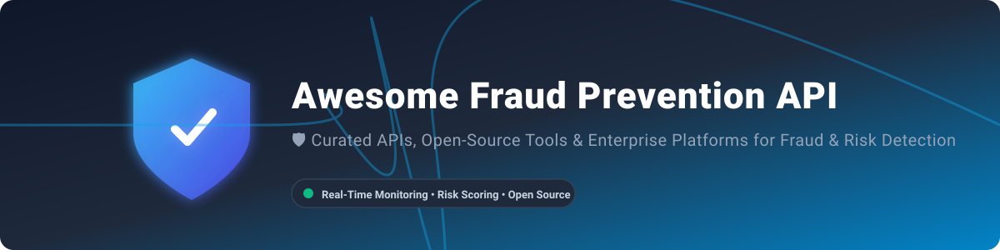

# 🛡️ Awesome Fraud Prevention API 🚀

 

---

## 📌 Top Fraud Prevention APIs & Platforms

A curated, SEO-optimized directory of top **fraud prevention APIs**, **risk scoring engines**, **AML transaction monitoring systems**, **bot management platforms**, and **abuse detection tools** for e-commerce, digital payments, account security, and chargeback prevention.

> **💡 Primary focus:** Production-ready **open-source software** and Developer-centric fraud prevention tools.

Commercial and hosted SaaS platforms are detailed with transparent pricing tiers and company size metrics.

---

## 🏢 SaaS / Hosted Platforms

Below is the list of top commercial SaaS platforms, sorted by **company size (annual revenue / valuation)** in descending order:

| Platform | Description | Key Focus | Company Size (Est. Revenue / Valuation) 📊 | Pricing (Starting Tier) 💰 | Free Tier / Trial Limits ⏳ |
|----------|-------------|-----------|---------------------------------------------|----------------------------|----------------------------|
| **[Forter](https://www.forter.com/)** 🛡️ | Decisioning platform for fraud, abuse, account protection, and policy enforcement with real-time identity & behavioral insights. | Identity-centric fraud + abuse prevention | **~$3 Billion Valuation** (~$103M Revenue) | Custom contract based on annual GMV & volume | No free tier or standard free trial |
| **[Feedzai](https://feedzai.com/)** 🏦 | End-to-end financial crime platform covering fraud detection, AML, behavioral analytics, and real-time transaction monitoring. | Banking-grade fraud + AML | **>$2 Billion Valuation** (~$167M Revenue) | Custom enterprise pricing | 60-day trial for select API tools / demo evaluation |
| **[Signifyd](https://www.signifyd.com/)** 🛒 | E-commerce fraud protection with chargeback guarantee, network intelligence, anomaly detection, and pre-auth screening. | Guaranteed fraud protection + conversion | **~$1.34 Billion Valuation** (~$292M Revenue) | % fee per approved transaction (quote-based) | 14-day free trial (No permanent free plan) |
| **[Sift](https://sift.com/)** 🔍 | Machine-learning fraud platform with real-time risk scores, global data network, account defense, and workflow automation. | Real-time risk scoring + global signals | **>$1 Billion Valuation** (~$157M Revenue) | Enterprise pricing (Volume-based per API call / quote-based) | No free tier or public free trial |
| **[Kount](https://kount.com/)** (Equifax) 🔒 | Fraud prevention with device intelligence, customizable rules, omnichannel support, and strong reporting. | Device + rules-based fraud prevention | **$640 Million Acquisition** by Equifax (~$45.5M Revenue) | Custom quote-based on transaction volume | No free tier or public free trial |
| **[Riskified](https://www.riskified.com/)** 💳 | E-commerce fraud prevention with chargeback guarantee, adaptive checkout, and real-time approval optimization. | Chargeback guarantee + approval optimization | **Public (NYSE: RSKD)** (~$297M Revenue) | Performance-based / % per approved order | No free tier or free trial |
| **[DataDome](https://datadome.co/)** 🤖 | Bot and online fraud protection focused on stopping automated attacks, scrapers, account takeover, and adversarial traffic in real time. | Bot management + adversarial traffic | **Series C (~$73M Revenue)** | Essentials plan from $3,830/month | 30-day free trial (Detection-only mode, no permanent free plan) |
| **[SEON](https://seon.io/)** 🕵️‍♂️ | Real-time fraud prevention and AML platform with rich data enrichment (email, phone, IP, digital footprint), and rule + AI hybrid decisioning. | Data enrichment + flexible scoring | **Series C (~$35M ARR)** | Free plan ($0/mo) / Starter from $599/month | Forever Free: 2,000 API calls/month (2 QPS limit) |
| **[Castle](https://castle.io/)** 🏰 | Account security and fraud prevention platform emphasizing device intelligence, risk scoring for login/registration, and privacy-conscious signals. | Account protection + device intelligence | **Private (~$9.3M ARR)** | Free evaluation tier / Pro plan from $200/month | Free tier: 1,000 API calls/month (3 seats, 3 days retention) |
| **[Fraud.net](https://www.fraud.net/)** ⚡ | Enterprise fraud detection and prevention with AI/ML, behavioral analytics, orchestration, and case management focused on financial crime. | Enterprise payment fraud + analytics | **Private (~$5.5M Revenue)** | Quote-based enterprise pricing | Free fraud analysis & evaluation demo (No permanent free plan) |

---

## 🔓 Open-Source Softwares

All open-source repositories are listed below, sorted by **GitHub Star Count** in descending order. Star badges link directly to each repository's stargazers page.

### 🌟 Top Open-Source Frameworks & Libraries (Sorted by Stars ⭐️)

| Project | Description | License | GitHub_Stars ⭐️ | Focus / Notes |
|---------|-------------|---------|----------------|---------------|
| **[FingerprintJS](https://github.com/fingerprintjs/fingerprintjs)** | Browser fingerprinting library for fraud detection, bot mitigation, and user identification using browser signals. | BSL 1.1 / Open | **** | Client-side device & browser fingerprinting |
| **[SHAP](https://github.com/slundberg/shap)** | Game-theoretic approach to explain the outputs of any machine learning fraud scoring model. | MIT | **** | Model explainability & auditability |
| **[Neo4j](https://github.com/neo4j/neo4j)** | Graph database platform widely used for detecting fraud rings, synthetic identity clusters, and linked entities. | GPLv3 | **** | Fraud ring & network graph analysis |
| **[PyOD](https://github.com/yzhao062/pyod)** | Comprehensive Python toolkit for detecting outlying and anomalous patterns in financial transactions. | BSD 2-Clause | **** | Unsupervised anomaly & outlier detection |
| **[Easy Rules](https://github.com/j-easy/easy-rules)** | Lightweight Java rules engine ideal for building custom fraud policies and real-time transaction scoring rules. | MIT | **** | Lightweight rule evaluation engine |
| **[Microsoft RulesEngine](https://github.com/microsoft/RulesEngine)** | Fast and lightweight .NET rules engine for defining dynamic fraud scoring and decisioning logic. | MIT | **** | Dynamic rule evaluation in C# / .NET |
| **[BotD](https://github.com/fingerprintjs/BotD)** | Open-source client-side library for detecting automated browser threats, scrapers, and headless bots. | MIT | **** | Browser bot & scraper detection |
| **[GraphPipe](https://github.com/oracle/graphpipe)** | Network protocol and server for high-performance ML model serving and real-time fraud scoring. | Apache-2.0 | **** | High-throughput ML model serving |
| **[Jube](https://github.com/jube-home/aml-fraud-transaction-monitoring)** | Real-time AML and fraud transaction monitoring platform with adaptive ML, rules, and case management. | AGPLv3 | **** | Full-stack AML & transaction monitoring |
| **[CreditGuard](https://github.com/omsingh-19/CreditGuard)** | Production-oriented credit risk and fraud scoring API built with FastAPI, XGBoost, MLflow, and PostgreSQL. | Open Source | **** | MLOps-style credit & fraud API |
| **[FraudProx](https://github.com/makozi/FraudProx)** | Real-time deep-learning fraud detection API using hybrid LSTM-CNN models exposed via FastAPI. | MIT | **** | Deep-learning mobile fraud API |

---

### 🧩 Specialized Building Blocks & Open Ecosystem

| Component Category | Description | Recommended Tools |
|--------------------|-------------|-------------------|
| **Device & Mobile Intelligence** 📱 | Self-hostable browser fingerprinting, mobile SDK risk signals (root, emulator, debugging). | FingerprintJS, OpenClientID, RiskEngine |
| **Rules & Decision Engines** ⚙️ | Dynamic business rule engines for evaluating payment thresholds and user policies. | Easy Rules, Microsoft RulesEngine, Drools |
| **Anomaly & Outlier Detection** 📊 | Statistical and ML algorithms for identifying fraudulent outlier transactions. | PyOD, scikit-learn, Isolation Forests |
| **Graph / Network Link Analysis** 🕸️ | Graph analytics to detect organized fraud rings and shared entity networks. | Neo4j, NetworkX, GraphML |
| **Model Explainability** 🧠 | Interpretable AI tools to output risk factors for compliance and analyst review. | SHAP, LIME |

---

## ⚡ Quick Start Recommendations

| Goal / Requirement | Recommended Starting Point 🎯 |
|--------------------|--------------------------------|
| Self-hosted AML + transaction monitoring stack | **Jube** |
| Production-grade ML fraud scoring API (FastAPI + XGBoost) | **CreditGuard** |
| Client-side browser device fingerprinting | **FingerprintJS** |
| Unsupervised fraud & anomaly detection | **PyOD** |
| High-performance rules engine | **Easy Rules** or **Microsoft RulesEngine** |
| Graph analysis for detecting fraud rings | **Neo4j** |
| Deep-learning real-time fraud API | **FraudProx** |
| Flexible SaaS data enrichment & scoring | **SEON** |
| Chargeback guarantee & pre-auth approval | **Signifyd** or **Riskified** |
| Enterprise identity & behavioral decisioning | **Forter** or **Sift** |
| Bot management & adversarial traffic defence | **DataDome** |

---

## 🤝 Contributing

Contributions, updates, and new open-source fraud detection projects are welcome!  
Please open an issue or submit a pull request.

---

## ⭐ Star History

<a href="https://www.star-history.com/?repos=ishandutta2007%2FAwesome-Fraud-Prevention-API&type=date&legend=bottom-right">
<picture>
<source media="(prefers-color-scheme: dark)" srcset="https://api.star-history.com/chart?repos=ishandutta2007/Awesome-Fraud-Prevention-API&type=date&theme=dark&legend=bottom-right" />
<source media="(prefers-color-scheme: light)" srcset="https://api.star-history.com/chart?repos=ishandutta2007/Awesome-Fraud-Prevention-API&type=date&legend=bottom-right" />

</picture>
</a>

---

**Last updated:** August 2026  
Maintained with ❤️ by the community. For awesome resource lists, visit [Awesome Awesome Awesome](https://github.com/ishandutta2007/Awesome-Awesome-Awesome).